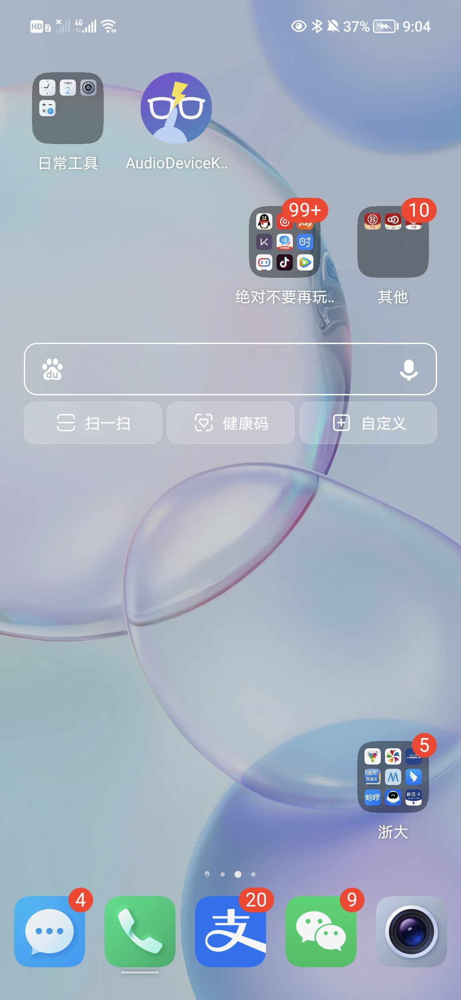
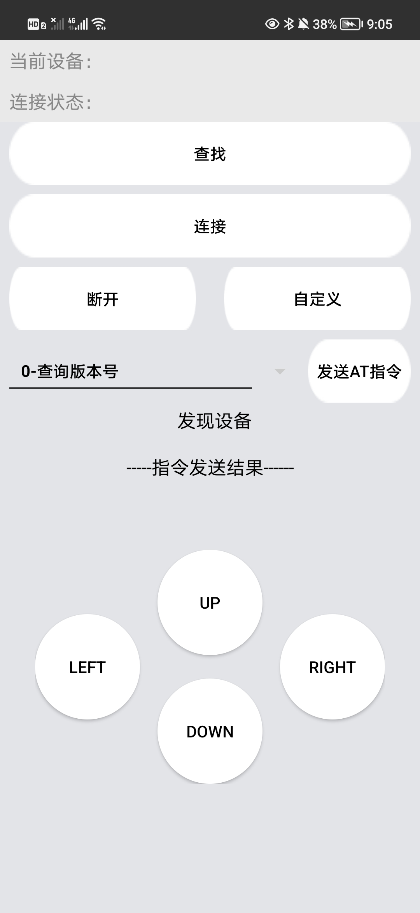
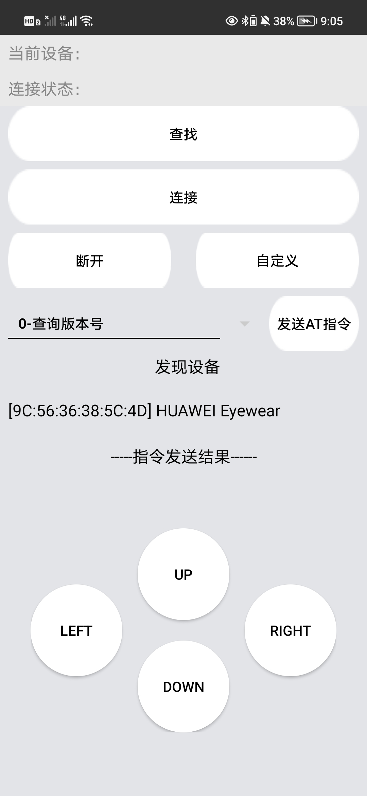
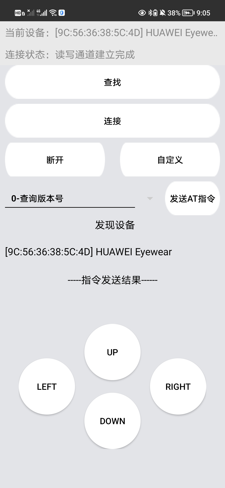
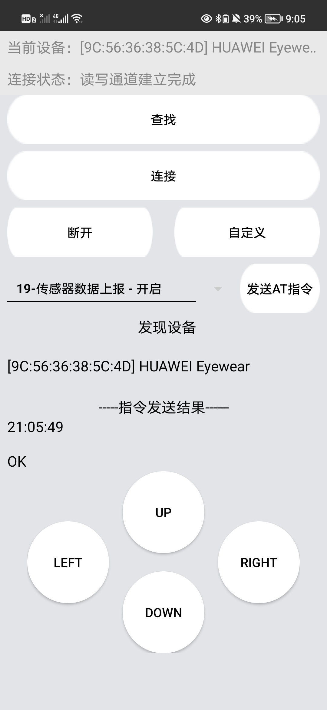
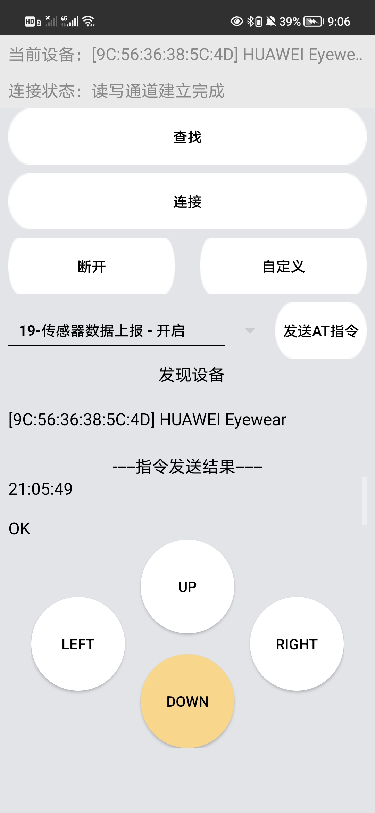
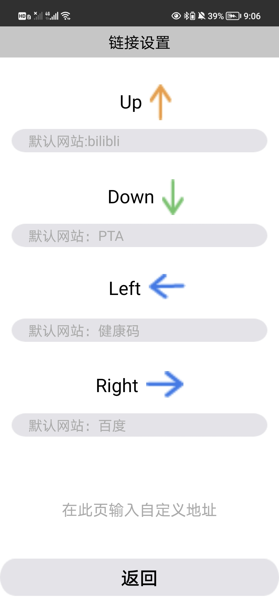
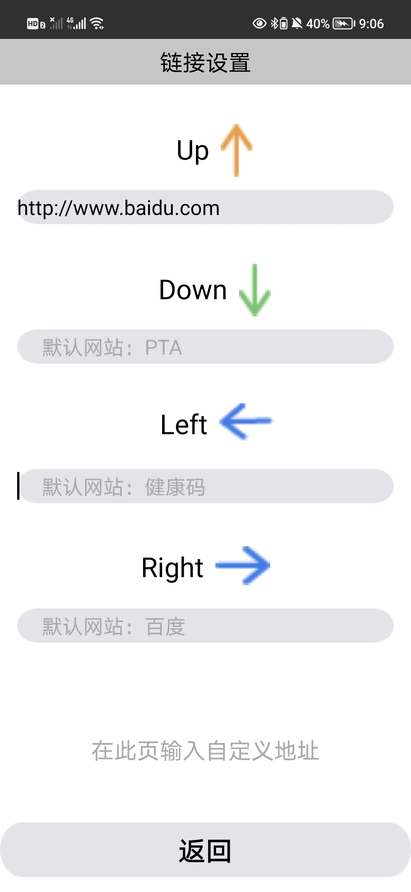

## readme

##### Contribution

###### 徐宇航(developer, team leader) 100%

mainly responsible for the overall code structure, video shooting, assisting team members to communicate, most of the code and UI implementation, and the actual test of the code.

###### 周旭涛(developer) 100%

Assisting the other two developers, mainly responsible for the UI part, as well as the sensor data collection part, and wrote a summary. Also participated in the actual testing of the code.

###### 康舒涵(developer) 100%

Technical data search and study, ppt production and modification, publicity video starring actor, final presentation and speech preparation, abstract polishing and modification

###### 陈舒娅(designer)

In the early stage, co-created the idea of the project direction with the team members and completed the ideas and production of the report ppt, and the visual and interactive design of the mobile page.

###### 潘子蔚(designer)

Work with the team to formulate project direction and product architecture, conduct user research and study, product interaction design and improvement, and complete video production and editing

### 1. Introduction to software operation

Find the icon of Instant Call-out to open the app

Open the app and the interface is as shown above.

After wearing Huawei smart glasses, click the search button to see the device information: 'HUAWEI Eyewear' and then click

After the connection is completed, the above results would appear.

Click 0-query version number, and select 19 functions in drop-down menu, the result is as shown above

At this point, if you move your head, you will find that the four buttons below will change with the orientation of the head.

For example, if your head is up at this time, and then double-click the temple, it will jump to the default web page Bilibili.

Of course, you can also customize the web page by yourself own web. Click the customize button, and enter the URL you want to set under the corresponding action.

Click return and repeat the previous operation to open the newly set URL.

### 2. Cloud Disk Link

https://pan.baidu.com/s/1hsyVX_ul5zgalWA21IHSyQ?pwd=gj8c 

### 3. Remark

- This group cooperated and completed the PPT together on figma. Thus, it can only be exported as pdf. So there is no ppt file.

